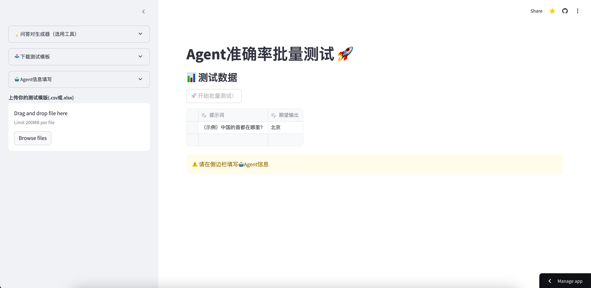

# AgentAcc-Batch-Test


## Quick Start
There is a website can be used directly to demo.
>https://agentacc-batch-test.streamlit.app/

## Get Started
To get started with Local Multimodal AI Chat, clone the repository and follow these simple steps:

0. **Change your path at first, which the folder is located in**
```Shell
cd AgentAcc-batch-test
```

1. **Create a Virtual Environment**: I am using Python 3.9.16 currently
```shell
conda create -n <your_environment_name> python==3.9.16 -y
conda activate <your_environment_name>
```

2. **Install Requirements**
```shell
pip install -r requirements.txt
```

3. **Enter commands in terminal**
```shell
streamlit run app/app.py
```

## Possible Improvements
* support multi-round dialogue
* ~~limit the quantity of the q-a pair generation~~
* ~~Clicking another button or blank space will refresh the page, resulting in data loss~~
* ~~show real-time output for the better experience while waiting for the output~~

